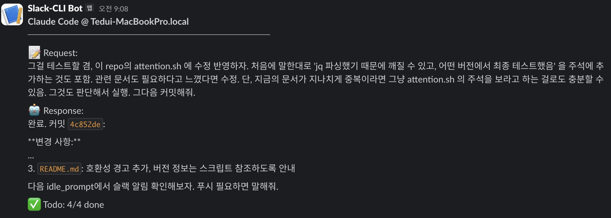

# Tools for AI-Native Product Team

코르카에서 유지보수하는, [AI-Native Product Team](AI_NATIVE_PRODUCT_TEAM.md)을 위한 도구들(서브에이전트, 스킬, 훅, 스크립트 등)을 모아두었습니다.

## Skills

### [clarify](.claude/skills/clarify/SKILL.md)

모호하거나 불명확한 요구사항을 반복적인 질문을 통해 명확하고 실행 가능한 사양으로 변환하는 스킬입니다.

[정구봉님](https://www.linkedin.com/in/gb-jeong/)의 [Team Attention](https://github.com/team-attention)에서 만든 [Clarify 스킬](https://github.com/team-attention/plugins-for-claude-natives/blob/main/plugins/clarify/SKILL.md)의 복제본입니다. 원래 가져와서 커스터마이즈했었는데 성능이 원본보다 떨어져서 다시 롤백했습니다. 꾸준히 사용하다가 개선점이 보이면 수정해볼 생각입니다.

**사용법**: "다음 요구사항을 명확하게 해줘", "clarify the following:" 등으로 트리거

**주요 기능**:
- 원본 요구사항 기록 후 체계적인 질문을 통해 모호함 해소
- Before/After 비교로 명확해진 결과 제시
- 명확해진 요구사항을 파일로 저장하는 옵션 제공. 필요시 이 문서를 Plan 모드에 넣어서 구현하면 됨

### [slack-to-md](.claude/skills/slack-to-md/SKILL.md)

1개 이상의 Slack 메시지 URL을 단일한 마크다운 문서로 변환하는 스킬입니다.

**사용법**: 
- 링크를 이용해 기존 메시지 취합하기: `slack-to-md <slack-message-url1> <slack-message-url2> <...>`
- 기존 문서 업데이트하기(예: 쓰레드에 새로 추가된 메시지를 기존 문서에 추가): `slack-to-md <path-to-file.md>`
- 그 외: `slack-to-md #foo 채널과 #bar 채널에서 이러저러한 내용을 취합해줘"

**주요 기능**:
- Slack 스레드의 모든 메시지를 마크다운으로 변환. 봇은 필요시 자동으로 해당 채널에 join
- 문서 생성을 위한 bash 스크립트를 이용해 토큰 절약
- 첫 메시지 내용을 기반으로 의미있는 파일명 자동 생성
- `slack-outputs/` 디렉토리에 저장

**필수 조건**:
- Node.js 18+ 필요
- `jq` 설치 필요 (JSON 파싱용)
- Slack Bot 설정 필요 ([생성 가이드](https://api.slack.com/apps)):
  - OAuth scopes: `channels:history`, `channels:join`, `users:read`
  - `.env.local`에 `BOT_TOKEN=xoxb-...` 설정

## Hooks

### [attention.sh](hooks/attention.sh)

Claude Code가 사용자의 입력을 60초 이상 기다릴 때(`idle_prompt` matcher 이용) Slack 또는 Discord로 푸시 알림을 보내는 훅입니다. 알림에는 작업 컨텍스트(사용자 요청, Claude 응답, Todo 상태)가 포함되어 어떤 작업인지 즉시 파악할 수 있습니다. 원격 서버에 세팅해뒀을 때 특히 유용합니다.

> ⚠️ **호환성 주의**: 이 스크립트는 Claude Code의 내부 transcript 구조를 `jq`로 파싱합니다. Claude Code 버전이 업데이트되면 동작하지 않을 수 있습니다. 테스트된 버전 정보는 스크립트 주석을 참조하세요.

**필수 조건**:
- `jq` 설치 필요 (JSON 파싱용)

**설정 방법**:

1. `hooks/attention.sh`를 `~/.claude/hooks/`에 복사
2. `~/.claude/.env` 파일 생성 후 웹훅 URL 설정:
```bash
# ~/.claude/.env
SLACK_WEBHOOK_URL="" # Slack 사용 시 설정
DISCORD_WEBHOOK_URL=""  # Discord 사용 시 설정
```
3. `~/.claude/settings.json`에 훅 설정 추가:

```json
{
  "hooks": {
    "Notification": [
      {
        "matcher": "idle_prompt",
        "hooks": [
          {
            "type": "command",
            "command": "~/.claude/hooks/attention.sh"
          }
        ]
      }
    ]
  }
}
```

**알림 내용**:
- 📝 사용자 요청 내용 (처음/끝 5줄씩 truncate)
- 🤖 요청에 대한 Claude의 응답 (처음/끝 5줄씩 truncate)
- ✅ Todo: 완료/진행중/대기 항목 수 및 각 항목 내용

**예시 알림**:



## 설치

```bash
# 스킬 설치 (프로젝트별)
cp -r .claude/skills/* <your-project>/.claude/skills/

# 훅 설치 (전역)
cp hooks/attention.sh ~/.claude/hooks/
chmod +x ~/.claude/hooks/attention.sh
```
