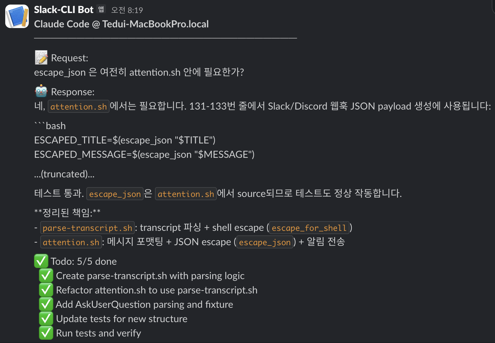
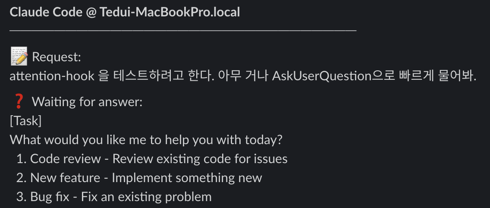

# corca-plugins

[한국어](README.ko.md)

A Claude Code plugin marketplace maintained by Corca for the [AI-Native Product Team](AI_NATIVE_PRODUCT_TEAM.md).

## Installation

### 1. Add and update the marketplace

```bash
claude plugin marketplace add https://github.com/corca-ai/claude-plugins.git
```

When new plugins are added or existing plugins are updated, update the marketplace first:
```bash
claude plugin marketplace update corca-plugins
```

Then install or update the plugin you need:
```bash
claude plugin install <plugin-name>@corca-plugins  # install
claude plugin update <plugin-name>@corca-plugins   # update
```

Restart Claude Code after installing/updating for changes to take effect.

You can do the same from inside Claude Code (instead of your terminal):
```
/plugin marketplace add corca-ai/claude-plugins
/plugin marketplace update
```

### 2. Plugin overview

| Plugin | Type | Description |
|---------|------|-------------|
| [clarify](#clarify) | Skill | Turn ambiguous requirements into an actionable spec |
| [interview](#interview) | Skill | Extract requirements through structured interviews |
| [suggest-tidyings](#suggest-tidyings) | Skill | Suggest safe refactoring opportunities |
| [retro](#retro) | Skill | Run a comprehensive end-of-session retrospective |
| [gather-context](#gather-context) | Skill | Auto-detect URLs and gather external content via built-in scripts |
| [web-search](#web-search) | Skill | Web search, code search, and URL content extraction |
| [attention-hook](#attention-hook) | Hook | Send a Slack notification when idle/waiting |
| [plan-and-lessons](#plan-and-lessons) | Hook | Inject the Plan & Lessons Protocol when entering plan mode |

## Skills

### [clarify](plugins/clarify/skills/clarify/SKILL.md)

**Install**:
```bash
claude plugin marketplace add https://github.com/corca-ai/claude-plugins.git
claude plugin install clarify@corca-plugins
```

**Update**:
```bash
claude plugin marketplace update corca-plugins
claude plugin update clarify@corca-plugins
```

A skill that turns vague or unclear requirements into clear, executable specs through iterative questioning. It is based on Team Attention's [Clarify skill](https://github.com/team-attention/plugins-for-claude-natives/blob/main/plugins/clarify/SKILL.md) and customized for our workflow. (Usage reference: Jeong Gubong's [LinkedIn post](https://www.linkedin.com/posts/gb-jeong_%ED%81%B4%EB%A1%9C%EB%93%9C%EC%BD%94%EB%93%9C%EA%B0%80-%EA%B0%9D%EA%B4%80%EC%8B%9D%EC%9C%BC%EB%A1%9C-%EC%A7%88%EB%AC%B8%ED%95%98%EA%B2%8C-%ED%95%98%EB%8A%94-skills%EB%A5%BC-%EC%82%AC%EC%9A%A9%ED%95%B4%EB%B3%B4%EC%84%B8%EC%9A%94-clarify-activity-7413349697022570496-qLts))

**How to use**: trigger with phrases like "clarify the following:" / "Please clarify this requirement"

**Key features**:
- Records the original request, then resolves ambiguity via structured questions
- Shows a clear Before/After comparison
- Optionally saves the clarified spec to a file (you can feed it into plan mode for implementation)

### [interview](plugins/interview/skills/interview/SKILL.md)

**Install**:
```bash
claude plugin marketplace add https://github.com/corca-ai/claude-plugins.git
claude plugin install interview@corca-plugins
```

**Update**:
```bash
claude plugin marketplace update corca-plugins
claude plugin update interview@corca-plugins
```

A skill created by Corca AX consultant [Jeonghyeok Choi](https://denoiser.club/) to match his preferred workflow. Its goal is similar to Clarify: it runs a structured interview to extract requirements, constraints, and design decisions, and documents the project's core requirements via conversation.

**Usage**:
- `/interview <topic>` - start a new interview (e.g., `/interview auth-system`)
- `/interview <topic> --ref <path>` - interview based on a reference file
- `/interview <topic> --workspace <dir>` - set the working directory

**Key features**:
- One question at a time for focused conversation
- Real-time notes written to `SCRATCHPAD.md`
- Generates a summarized `SYNTHESIS.md` at the end
- Automatically detects and adapts to the user's language (Korean/English)

**Outputs**:
- `SCRATCHPAD.md` - real-time notes during the interview
- `SYNTHESIS.md` - consolidated requirements synthesis
- `JUST_IN_CASE.md` - extra context for future agents (optional)

### [suggest-tidyings](plugins/suggest-tidyings/skills/suggest-tidyings/SKILL.md)

**Install**:
```bash
claude plugin marketplace add https://github.com/corca-ai/claude-plugins.git
claude plugin install suggest-tidyings@corca-plugins
```

**Update**:
```bash
claude plugin marketplace update corca-plugins
claude plugin update suggest-tidyings@corca-plugins
```

A skill based on Kent Beck's "Tidy First?" philosophy. It analyzes recent commits and finds safe refactoring opportunities. It uses parallel sub-agents to review multiple commits at once.

**Usage**:
- Analyze the current branch: `/suggest-tidyings`
- Analyze a specific branch: `/suggest-tidyings develop`

**Key features**:
- Finds tidying opportunities from recent non-tidying commits
- Parallel per-commit analysis (Task tool + sub-agents)
- Applies 8 tidying techniques (guard clauses, dead code removal, extract helper, etc.)
- Safety check: excludes code that has already changed on HEAD
- Actionable suggestions in the format `file:line-range — description (reason: ...)`

**Core principles**:
- Safe changes that only improve readability (no logic changes)
- Atomic edits that can be separated into a single commit
- Simple diffs that are easy for anyone to review

### [retro](plugins/retro/skills/retro/SKILL.md)

**Install**:
```bash
claude plugin marketplace add https://github.com/corca-ai/claude-plugins.git
claude plugin install retro@corca-plugins
```

**Update**:
```bash
claude plugin marketplace update corca-plugins
claude plugin update retro@corca-plugins
```

A skill that runs a comprehensive retrospective at the end of a session. If `lessons.md` in the [Plan & Lessons Protocol](plugins/plan-and-lessons/protocol.md) is a progressively accumulated learning log, `retro` is a "full-session, bird's-eye" retrospective.

**Usage**:
- End of a session: `/retro`
- With a specific directory: `/retro prompt-logs/260130-my-session`

**Key features**:
- Documents user/org/project context that will help future work
- Observes working style and collaboration patterns and suggests CLAUDE.md updates (applies only with user approval)
- Suggests prompting habit improvements (with concrete examples from the session)
- Shares learning resources tailored to the user's knowledge/experience level
- Can recommend workflow skills via find-skills or plan new skills via skill-creator

**Outputs**:
- `prompt-logs/{YYMMDD}-{title}/retro.md` — saved alongside plan.md and lessons.md

### [gather-context](plugins/gather-context/skills/gather-context/SKILL.md)

**Install**:
```bash
claude plugin marketplace add https://github.com/corca-ai/claude-plugins.git
claude plugin install gather-context@corca-plugins
```

**Update**:
```bash
claude plugin marketplace update corca-plugins
claude plugin update gather-context@corca-plugins
```

An integrated skill that detects URL types and gathers external content into local files. It includes built-in converters, so it can gather Google Docs, Slack, and Notion content with a single plugin **without installing separate skills**. It combines the functionality of [`slack-to-md`](https://www.stdy.blog/1p1w-01-slack-to-md/), [`g-export`](https://www.stdy.blog/1p1w-02-g-export/), and `notion-to-md`.

**Usage**:
- Explicit invocation: `/gather-context <url>`
- URL detection: if the agent encounters a supported service URL, it automatically runs the right converter

**Supported services**:

| URL pattern | Handler |
|----------|--------|
| `docs.google.com/{document,presentation,spreadsheets}/d/*` | Google Export (built-in script) |
| `*.slack.com/archives/*/p*` | Slack to MD (built-in script) |
| `*.notion.site/*`, `www.notion.so/*` | Notion to MD (built-in script) |
| Other URLs | WebFetch fallback |

**Output directory**: default `./gathered/` (override with `CLAUDE_CORCA_GATHER_CONTEXT_OUTPUT_DIR`; you can also set per-service env vars)

**Note**:
- If you need information lookup, consider using `/web-search`.

### [web-search](plugins/web-search/skills/web-search/SKILL.md)

**Install**:
```bash
claude plugin marketplace add https://github.com/corca-ai/claude-plugins.git
claude plugin install web-search@corca-plugins
```

**Update**:
```bash
claude plugin marketplace update corca-plugins
claude plugin update web-search@corca-plugins
```

A skill that uses the Tavily and Exa REST APIs for web search, code search, and URL content extraction. It calls external search services directly via curl.

**Usage**:
- Web search: `/web-search <query>`
- Code/technical search: `/web-search code <query>`
- URL extraction: `/web-search extract <url>`

**Key features**:
- General web search via Tavily (summary + sources)
- Specialized code/technical search via Exa (GitHub, Stack Overflow, docs, etc.)
- Extracts URL content into Markdown
- Automatically chooses jq or python3 to parse JSON
- Includes a Sources section in results

**Requirements**:
- `TAVILY_API_KEY` — required for web search and URL extraction ([get a key](https://app.tavily.com/home))
- `EXA_API_KEY` — required for code search ([get a key](https://dashboard.exa.ai/api-keys))
- Set keys in `~/.zshrc` or `~/.claude/.env`

**Caution**:
- Your queries are sent to external search services. Do not include confidential code or sensitive information in search queries.

## Hooks

### [attention-hook](plugins/attention-hook/hooks/hooks.json)

**Install**:
```bash
claude plugin marketplace add https://github.com/corca-ai/claude-plugins.git
claude plugin install attention-hook@corca-plugins
```

**Update**:
```bash
claude plugin marketplace update corca-plugins
claude plugin update attention-hook@corca-plugins
```

A hook that sends Slack push notifications when Claude Code is waiting for user input. The notification includes task context (user request, Claude response, AskUserQuestion prompt, and Todo status) so you can immediately understand what's going on. Useful when running on a remote server. (Background: [blog post](https://www.stdy.blog/1p1w-03-attention-hook/))

**Notification triggers**:
- `idle_prompt`: when Claude Code waits for user input for 60+ seconds (Claude Code internal behavior; cannot be changed)
- `AskUserQuestion`: when Claude asks a question and there is no response for 30+ seconds (tunable via `CLAUDE_ATTENTION_DELAY`)

> **Compatibility note**: this script parses Claude Code's internal transcript structure using `jq`. It may break when Claude Code updates. See the script comments for the tested version info.

**Requirements**:
- `jq` installed (for JSON parsing)
- Slack bot + an Incoming Webhook URL for the channel

**Setup**:

1. Create `~/.claude/.env` and set your webhook URL:
```bash
# ~/.claude/.env
SLACK_WEBHOOK_URL=""
CLAUDE_ATTENTION_DELAY=30  # AskUserQuestion notification delay in seconds (default: 30)
```

2. After installing the plugin, `hooks/hooks.json` is applied automatically.

**Notification contents**:
- 📝 User request (first/last 5 lines, truncated)
- 🤖 Claude response (first/last 5 lines, truncated)
- ❓ Waiting on a question: AskUserQuestion prompt + choices (if any)
- ✅ Todo: counts of done/in-progress/pending items and their text

**Examples**:





### [plan-and-lessons](plugins/plan-and-lessons/hooks/hooks.json)

**Install**:
```bash
claude plugin marketplace add https://github.com/corca-ai/claude-plugins.git
claude plugin install plan-and-lessons@corca-plugins
```

**Update**:
```bash
claude plugin marketplace update corca-plugins
claude plugin update plan-and-lessons@corca-plugins
```

A hook that automatically injects the Plan & Lessons Protocol when Claude Code enters plan mode (via the `EnterPlanMode` tool call). The protocol defines a workflow that creates plan.md and lessons.md under `prompt-logs/{YYMMDD}-{title}/`.

**How it works**:
- Uses a `PreToolUse` → `EnterPlanMode` matcher to detect plan-mode entry
- Injects the protocol document path via `additionalContext`
- Claude reads the protocol and follows it

**Notes**:
- If you enter plan mode directly via `/plan` or Shift+Tab, the hook won't fire (CLI mode toggle; no tool call happens)
- For better coverage, also referencing the protocol from `CLAUDE.md` is recommended

## Removed skills

The following skills were removed in v1.8.0. The same functionality is now built into [gather-context](#gather-context).

| Removed skill | Replacement |
|------------|------|
| `g-export` | `gather-context` (built-in Google Docs/Slides/Sheets) |
| `slack-to-md` | `gather-context` (built-in Slack thread export) |
| `notion-to-md` | `gather-context` (built-in Notion page export) |

**Migration**:
```bash
claude plugin install gather-context@corca-plugins
```

## License

MIT
